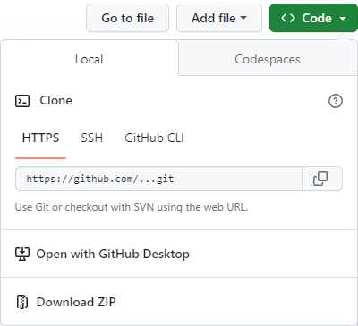

# Лабораторная работа по модульному тестированию

Порядок выполнения:

1. Скачать файлы с репозитория. На github нажать на кнопку `<> Code`, в выпадающем окне нажать Download ZIP.
1. Распаковать архив в папку с вашими проектами.
1. С помощью консоли перейти в данную папку и выполнить команды:
    1. `python -m venv venv` - создает виртуальное окружение, чтобы все пакеты ставились затем в него.
    1. `.\venv\Scripts\activate` - на windows активирует созданное окружение.
    1. `pip install pytest` - устанавливает пакет pytest в созданное виртуальное окружение.

Если при активации окружения возникает ошибка "...Scripts\Activate.ps1 cannot be loaded because running scripts is disabled on this system." необходимо запустить PowerShell с правами администратора и выполнить команду `Set-ExecutionPolicy RemoteSigned`. Затем перезагрузить PowerShell и ошибка уйдет.

## Задание 1

1. Напишите код функции `array_diff` в файле `task1.py` на месте комментария `# ВАШ КОД ТУТ`. Описание работы самой функции приведено там же.
1. Изучите код тестов в файле `test_task1.py`. Это может упростить понимание работы функции и ее граничных условий.
1. Запускайте тесты с помощью команды `pytest test_task1.py`.
1. Если какие-то тесты вы не прошли (стоит буква F), то необходимо поправить реализацию функции и снова запустить тесты. И так пока все тесты не будут пройдены.
1. Для защиты работы подготовьте краткий отчет, в котором после титульного листа разместите листинг вашего кода и снимок экрана с сообщением о прохождении всех тестов из консоли.

## Задание 2

1. В файле `task2.py` написана функция для расчета количества тортов `count_cakes`.
1. Ваша задача в файле `test_task2.py` дописать четыре теста под условия в комментариях.
1. Для проверки работы тестов выполните команду `pytest test_task2.py`
1. Незначительно измените код функции `task2.py`, чтобы убедиться, что тест, который покрывал этот случай теперь выдает ошибку.
1. В отчете после титульного листа, приведите листинг файла `task2.py`, также листинг измененной функции `count_cakes` с описанием вашего изменения и почему теперь тест или тесты выдают ошибки.